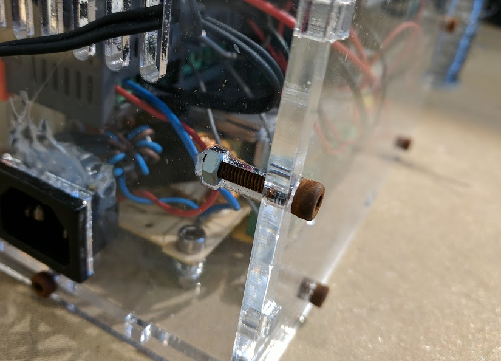

# Fusion 360 Captive Nut Joint Addin 
Creates captive nut joints typically found on laser-cut enclosures.

## Demo

## Installation
[Click here to download the Add-in](https://github.com/sirusdv/Fusion360CaptiveJointAddin/archive/master.zip)

After downloading the zip file follow the [installation instructions here](https://tapnair.github.io/installation.html) for your particular OS version of Fusion 360 

## Credits

Written by [Mikhail Davidov](https://twitter.com/sirus).

Utilizes the awesome [Fusion 360 Utilities](https://tapnair.github.io/index.html) by [Patrick Rainsberry](https://twitter.com/prrainsberry)